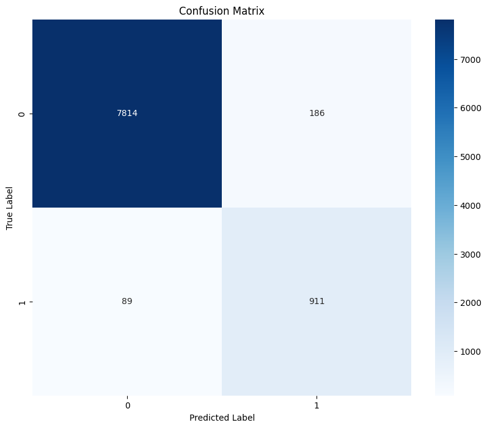
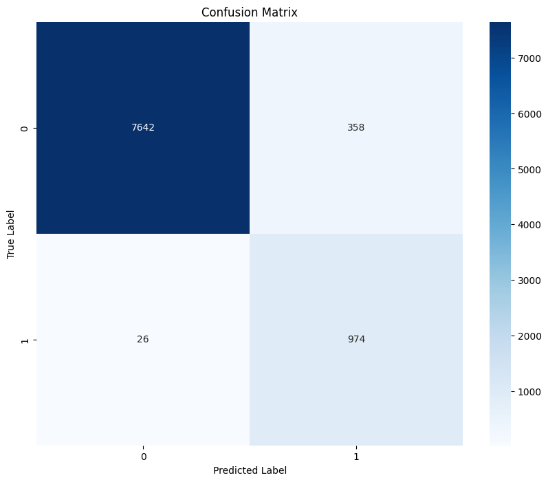
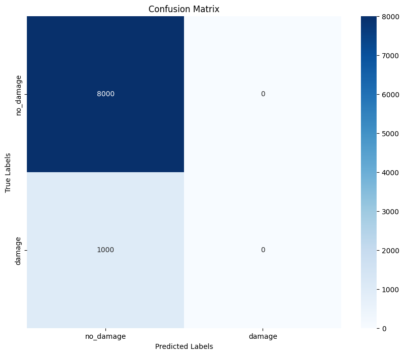
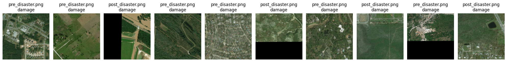

# Satellite-Classification-for-Post-hurricane-Damage
## Table of Contents
- [Project Idea](#project-idea)
- [Data](#data)
- [Model](#model)
- [Result](#result)
- [Repository](#repository)
- [Conclusion](#conclusion)

## Project Idea
### Overview
In recent years, advancements in deep learning have significantly bolstered natural disaster management and response efforts. These models are particularly adept at analyzing aerial and satellite imagery to swiftly and accurately pinpoint areas impacted by disasters. For instance, in flood monitoring scenarios, deep learning can assess water levels and forecast potential flooding, thereby contributing to more effective early warning systems.
Our project aims to harness the power of multiple Convolutional Neural Networks (CNNs) and Vision Transformers to create a system that efficiently and accurately classifies satellite imagery of regions affected by hurricanes.

## Data
### Data Source
- Satellite Images for Hurricane Damage (accessible at ieee-dataport.org/open-access/detecting-damaged-buildings-post-hurricane-satellite-imagery-based-customized).

### Data Description
- The data include satellite images labeled as `damage` and `no_damage`.
- We have curated a dataset comprising 11,000 training images, 2,000 validation images, and 9,000 testing images, all sourced from post-Hurricane Harvey scenarios in 2017. It is important to note that our testing dataset intentionally includes a disproportionate representation of classes to rigorously test and enhance the model's ability to generalize in varied and challenging conditions.

### Data Preprocessing
- Based on different model, different preprocessing tools were used like data augmentation, flips, resize, normalization and etc.
    

## Model
### Model Selection
- Alexnet
- VGG-16
- Resnet with Transfer Learning
- Vision Transformer

### Training
- Adam optimizer
- Sparse categorical cross-entropy Loss or Binary cross-entropy Loss based on the model

### Evaluation
We aim to evaluate our model's performance in a context beyond our specific dataset. For this purpose, we utilize the xBD Dataset which comprises satellite imagery captured before and after various disasters.

## Result
### Comparison of Model Performance

| Model                         | Accuracy | ROC    | PR     | F-1 Score | params    |
|-------------------------------|----------|--------|--------|-----------|-----------|
| AlexNet                       | 0.9694   | 0.9439 | 0.8757 | 0.8689    | 62421602  |
| VGG16                         | 0.9573   | 0.9646 | 0.8541 | 0.8353    | 134268738 |
| ResNet with Transfer Learning | 0.9812   | 0.9811 | 0.9978 | 0.9894    | 23452417  |
| Vision Transformer            | 0.9663   | 0.9635 | 0.8628 | 0.8481    | 85800194  |

### Confusion matrices

  
   

  
  

### Testing on new xBD satellite images

*Top: Occurrence of Disaster 
Bottom: Predicted Damag*

## Repository
- The code for training and evaluating each model are located in their notebook.
- the best model checkpoints and data can be downloaded from `https://drive.google.com/drive/folders/14Nt-wu3Kzfq6gfVzZID4adFvOb3NhWYx?usp=sharing`

## Conclusion
The models we implemented have shown satisfactory effectiveness in identifying flood damage post-hurricane, offering a range of performance levels and complexities. However, their ability to classify other damage types is limited, and their effectiveness is reduced on unbalanced datasets. To enhance performance, we are considering adopting ensemble learning techniques and using a more varied dataset that includes different types of damage.
